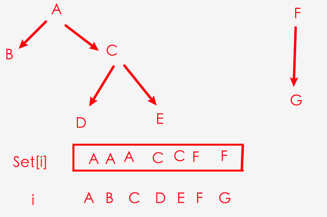
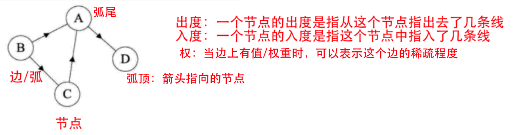
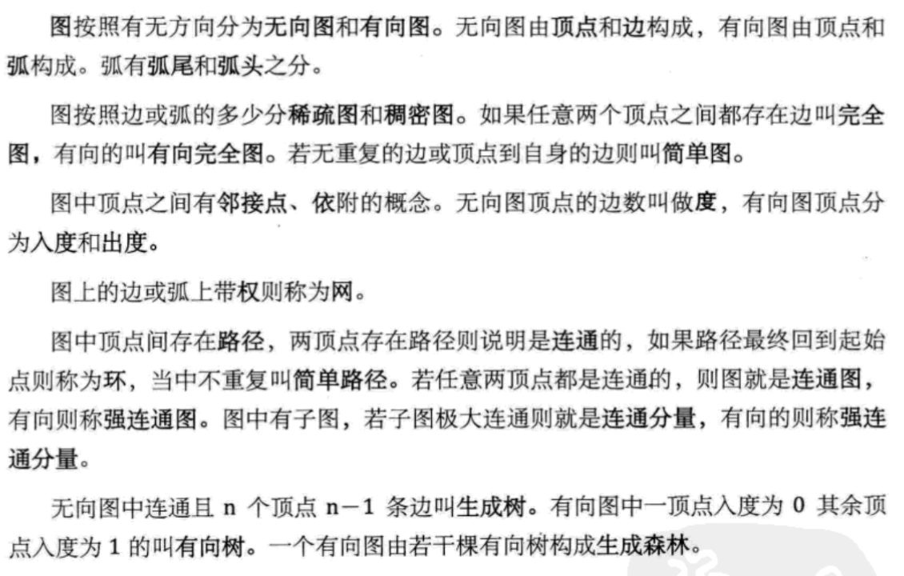
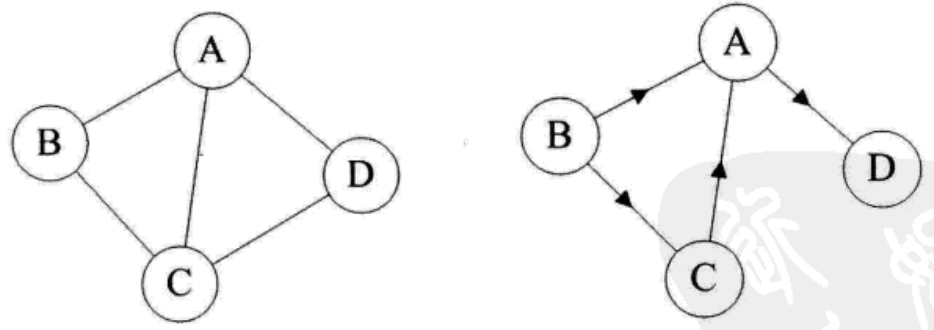
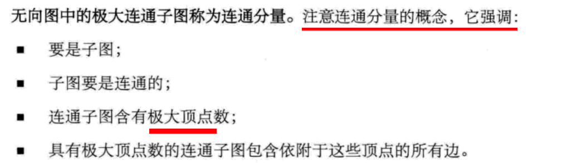
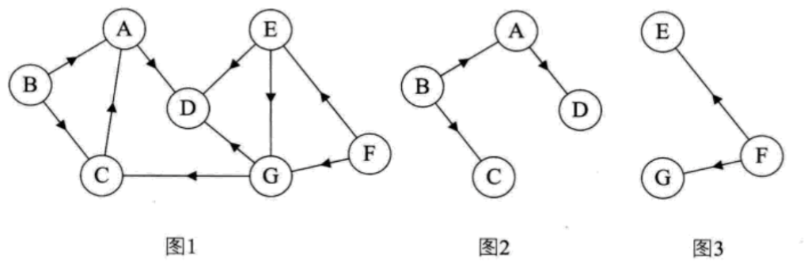

## 1 并查集

### （1）查找

Set[i]里存储的是i的上级，如果一个值是最高点，那么Set[i]存储的就是它自己。

如果要查找D 和 B是否有关联，可以通过Set[D] --> C Set[C] --> A. Set[A]--> A  那么D的最高领导是A

Set[B]--> A. Set[A]-->A 那么B的最高领导也是A，所以D和B是有关联的

```js
// 查找某一个值的最高领导
function findX(x) {
	let temp = x
	while(Set[temp] !== temp) {
		temp = Set[temp]
	}
	return temp
}
```



### （2）合并两个树

将深度小的树，合并至深度大的树上

## 2 图论

### （1）相关概念

无向图、无向完全图、有向图、有向完全图





### （2）图的表示

（1）对于无向图 G来说，G1=(V1,{E¡})，其中顶点集合 V1={A,B,C,D};边集合E1={(AB)，(B,C)，(CD)，(D,A)，(A,C)}，注意无向图的边是用()表示；

（2）对于有向图 G2来说，G2=(V2, {E2})，其中顶点集合 V2={A,B,C,D};弧集合 E2={<A,D>,<B,A>,<C,A>,<B,C>}，注意有向图的边是用<>表示；



### （3）连通图(连通分量)、强连通图(强连通分量)

图中，任意一个节点Vi到节点Vj有路径，Vj到Vi也有路径，那么这个图就是连通图，极大连通子图就称为连通分量。「无向图里叫连通图/连通分量，有向图里叫强连通图/强连通分量」



### （4）有向树

如果一个有向图恰有一个顶点的入度为0，其余顶点的入度均为1，则是一棵有向树。

#### （4.1）有向图的生成森林

如果一个有向图恰有一个顶点的入度为0，其余顶点的入度均为1，则是一棵有向树。
一个有向图的生成森林由若干棵有向树组成，含有图中全部顶点，但只有足以构成若干棵不相交的有向树的弧。

如图1是一棵有向图。去掉一些弧后，它可以分解为两棵有向树，如图2 和图3，这两棵就是图1有向图的生成森林。


